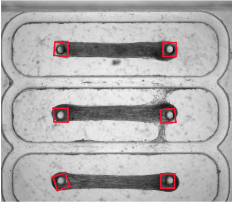

# object_tracker

This is an object tracker I developed to automate data collection for experiments in the Biological Machines research group at Saif lab at UIUC. The purpose of this program is to track the discplacement of moving muscle pillars from video datasets. More can be read about it in the links below: 

-  https://aip.scitation.org/doi/full/10.1063/1.5134477
-  https://www.pnas.org/content/116/40/19841

## Method
The dataset of images looked roughly like the following:

I would like to detect the squares in the image, as visualized below: 

the objects are detected with a Hough Circle Transform in openCV. They are then processed to bring out the square shape of the muscle pillars. We get the points to track on the object with the Shi-Tomasi goodFeaturesToTrack() function. The points are tracked with calcOpticalFlowPyrLK().

## Demo
To run the program, go to the head directory and do the following:
- run `make`
- in the directory, `./collect <video filename goes here> <output csv name goes here>`

(ex: `./collect data/videos/Test21.avi results/Test21_results.csv`)

- the results are stored in the location where you put the output csv

The program looks like the following: 

One object gets tracked at a time. The detected objects' bounding boxes are stored in a `vector<Rect2f>`, and the tracker loops through the vector. I hope to parallelize this loop at some point.

## Requirements
- C++
- g++ >=7.0.0 
- OpenCV >=3.2.0

## TODO
I would like to implement some other features:

- Parallel tracking of multiple detected objects with OpenMP
- Utilize my GPU for better performance in tracking
- ability switch between object detectors (rather than use my circle transfrom, use a Single Shot Detector for other objects, etc.) 
